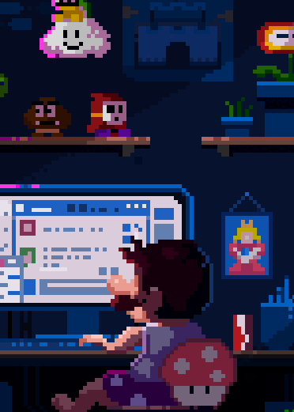

 

<h1 align= center>⬇️ <i>Sobre mim</i> ⬇️</h1>
<section align= center>

<ul align= left>
<li> 🚀 Sou um desenvolvedor Frontend júnior, ambicioso, focado para crescer na carreira e sempre buscando construir projetos escaláveis e de fácil manutenção. Estou me dedicando ao máximo no ramo da tecnologia.</li> 
<li> 🖥️ Atualmente eu faço faculdade na área de Ciência da Computação, estou no 6° período e com previsão de formação para dezembro de 2025.</li> 
<li> 🧙🏻‍♂️ Sou Aluno do curso Dev Quest - Desenvolvimento Full Stack do Dev em Dobro.</li>  
<li> 🔮 Meu objetivo futuro é me tornar um programador Full Stack e impactar positivamente na vida das pessoas com o meu trabalho.</li>
</ul>
</section>

    

 <h1 align= center>⚒️ <i>Tecnologias</i> ⚒️</h1>

<section>

 

  

</section>

     

<h1 align= center>🗨️ <i>Contatos</i> 💬</h1>
 

 
  
  
  

  

<h1 align= center>📈 <i>Atividade</i> 📈</h1> 
<section>
  
   
   

   
   </section>

    